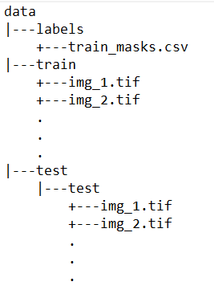

# Nerve Segmentation

### Table of Contents

- [Project Motivation](#motivation)
- [Project Components](#components)
  - [Image Masks](#mlb)
  - [Custom Image Transformation + Image Generator](#mls)
  - [Deep Neural Net](#dnn)
- [Usage](#usage)
- [Contribute](#contribute)
- [Acknowledgement](#ack)

***

<a id='motivation'></a>

## 1. Project Motivation

Improve pain management through the use of indwelling catheters that block or mitigate pain at the source. Pain management catheters reduce dependence on narcotics and speed up patient recovery. So, accurately identifying nerve structures in ultrasound images is a critical step in effectively inserting a patient’s pain management catheter. 

<a id='components'></a>

## 2. Project Components

There are three components in this project:

<a id='mlb'></a>

### 2.1. Image Masks

[RLE](https://en.wikipedia.org/wiki/Run-length_encoding)--Run Length Encoding--is used to properly encode the pixels where the image segmentation is to be done. This allows us to reduce the encoding size while still conveying most of the information.

<a id='mls'></a>

### 2.2. Custom Image Transformation + Image Generator

In order to work with less data, we can transform/augment the images to generate new images for the model to train on. As such, functions `randomHueSaturationValue`, `randomShiftScaleRotate` and `randomHorizontalFlip` have been created.<br>
Along with this, `train_generator` and `valid_generator` have been used to feed the data into the model. Although Keras has provided generators for this task, I found that custom image transformations work well with custom with custom generators

<a id='dnn'></a>

### 2.3. Deep Neural Net

Coming to the deep neutral network being used, I've gone with the quite basic `U-Net-256` that develops a very strong baseline to work with. It is not computationally expensive and gets the job done. Finally, the dice loss (dice coefficient can be used to compare the pixel-wise agreement between a predicted segmentation and its corresponding ground truth) is used as an evaluation metric.

***

<a name="usage"/>

## Usage

<a id='local'></a>

The entire notebook was run on Google's servers using Google [colab](https://colab.research.google.com). You too can run this code there by uploading the data to Google Drive. Make sure to have your data in the following structure: <br><br>


***

<a name="contribute"/>

## Contribute
1.  Fork the repository from Github
2.  Clone your fork

`https://github.com/kaustubh-ai/-Ultrasound-Nerve-Segmentation.git`

3.  Add the main repository as a remote

```git remote add upstream https://github.com/kaustubh-ai/-Ultrasound-Nerve-Segmentation.git```

4.  Create a pull request!

***

<a id='ack'></a>

## Acknowledgement
A very big thanks to Kaggle for this [data](https://www.kaggle.com/c/ultrasound-nerve-segmentation/data)!
